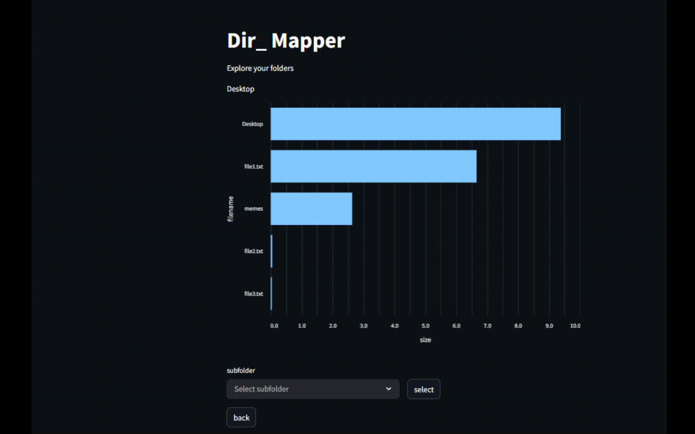

## DirScanner 📂🔍
### Visualize 📊

The visualization is made with streamlit. after running the ```main.py``` file on your desired directory, <br>
change the file name inside ```"dirscanner_app.py"``` to the outputed csv (default is set to "root.csv"). <br>
then run the app using ```"streamlit run dirscanner_app.py"```.



giving you a way to visualize the output and explore your directory by file sizes. <br>

### TODO ☑:
- [ ] Default folder (root) should not be in the drilldown menu.
- [ ] add "type" (file/folder) to tooltip of bars.
- [ ] add table visualization.
